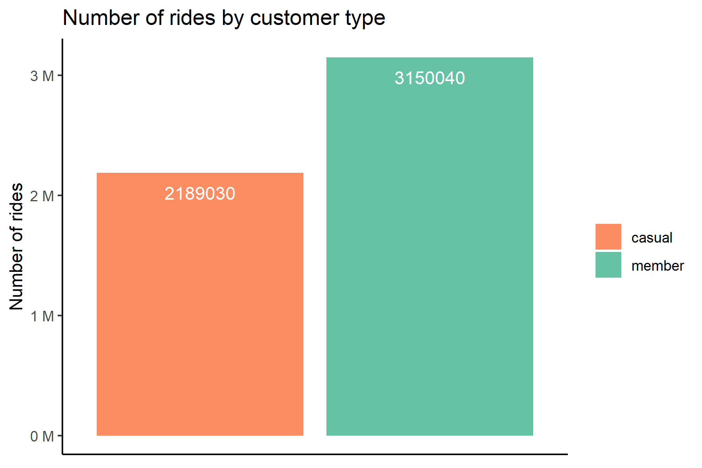
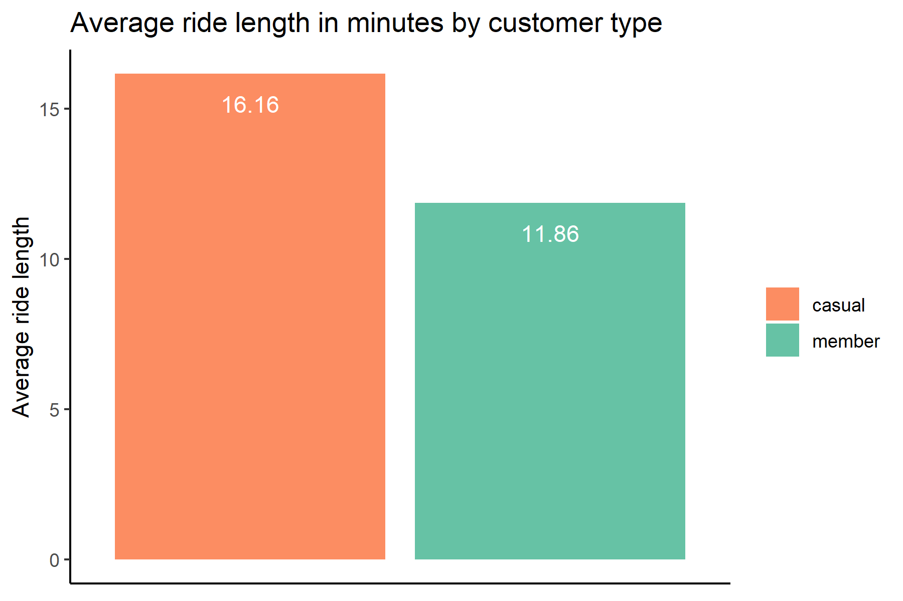
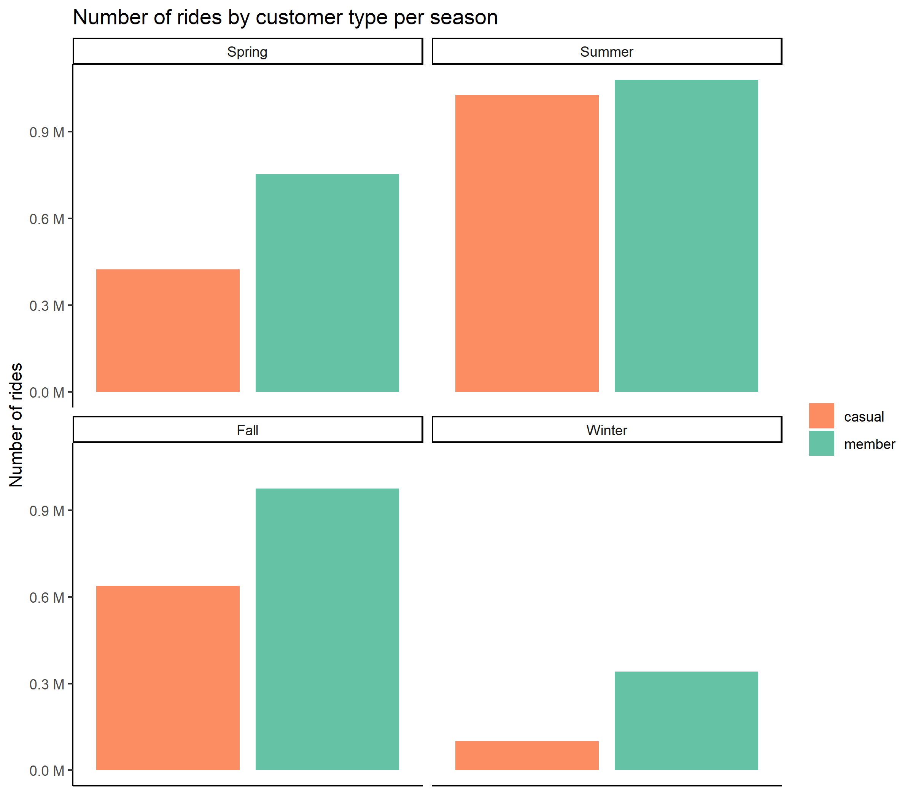
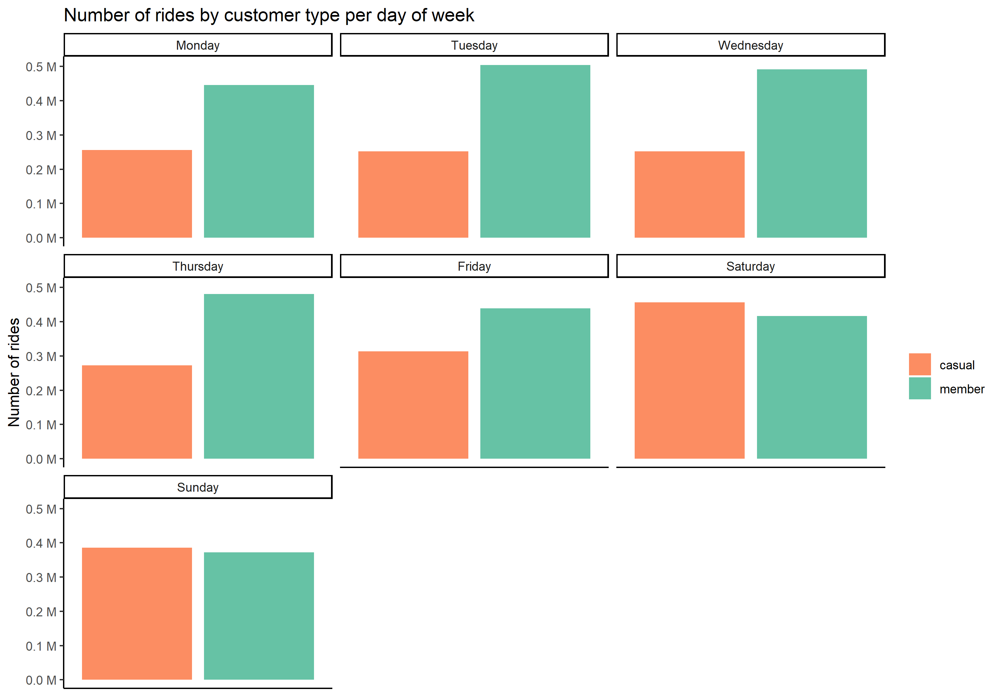
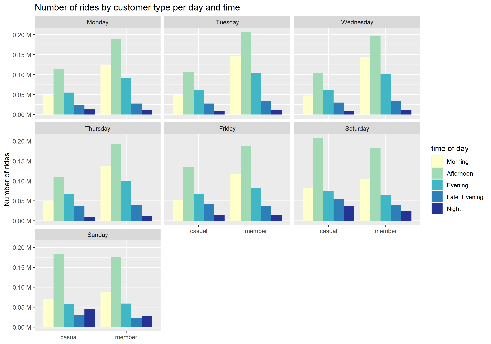
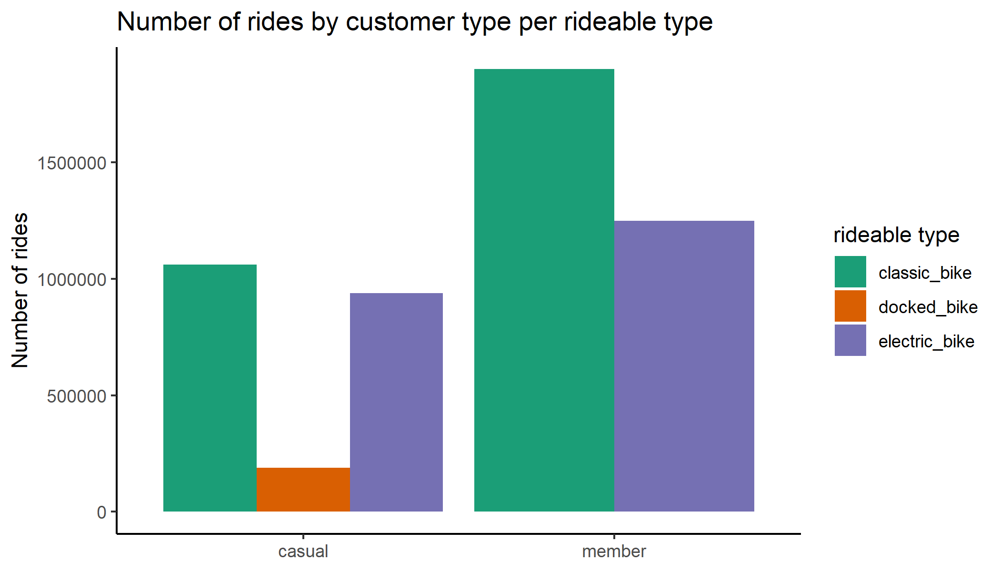

# About this Certificate

The Google Data Analytics Professional Certificate contains 8 courses (over 180 hours of instruction and hundreds of practice-based assessments) and anyone can enroll on Coursera. This certificate taught me skill in R, data visualization, data cleansing, data analysis, spreadsheet, Tableau, SQL, and much more. To learn more, click [here](https://www.coursera.org/professional-certificates/google-data-analytics#about).

## Introduction

This repository showcases my capstone projects from the final course of the certificate. I will be following the steps of the data analysis process (ask, prepare, process, analyze, share, act) I learned throughout the courses, and the case study roadmap provided as a guide.

Case Study \#1: How Does a Bike-Share Navigate Speedy Success?

## Background

**About the company:**
In 2016, Cyclistic launched a successful bike-share offering. Since then, the program has grown to a fleet of 5,824 bicycles that are geotracked and locked into a network of 692 stations across Chicago. The bikes can be unlocked from one station and returned to any other station in the system anytime.

**Scenario:**
You are a junior data analyst working in the marketing analyst team at Cyclistic, a bike-share company in Chicago. The director of marketing believes the company’s future success depends on maximizing the number of annual memberships. Therefore, your team wants to understand how casual riders and annual members use Cyclistic bikes differently. From these insights, your team will design a new marketing strategy to convert casual riders into annual members.

This report includes the following deliverables:

1.  A clear statement of the business task
2.  A description of all data sources used
3.  Documentation of any cleaning or manipulation of data
4.  A summary of your analysis
5.  Supporting visualizations and key findings
6.  Your top three recommendations based on your analysis

### Business Task:

Identify trends and differences between members and casual riders using Cyclistic historical bike trip data to help design marketing strategies for the Cyclistic marketing analytics team.

### Data Source Description:

The data is located [here](https://divvy-tripdata.s3.amazonaws.com/index.html), and I downloaded the most recent 12 CSV files (**06/2021 to 05/2022**) for my analysis. 

Each CSV file contains one month of historical data and has **13 columns** which are:

-   **ride_id**: Unique id per ride.
-   **rideable_type**: Classic_bike, Electric_bike, or docked_bike
-   **started_at**: Date and time when the ride started
-   **ended_at**: Date and time when the ride ended
-   **start_station_name**: The station name of where the ride started
-   **start_station_id**: The station id of where the ride started
-   **end_station_name**: The station name of where the ride ended
-   **end_station_id**: The station id of where the ride ended
-   **start_lat**: The latitude of where the ride started
-   **start_lng**: The longitude of where the ride started
-   **end_lat**: The latitude of where the ride ended
-   **end_lng**: The longitude of where the ride ended
-   **member_casual**: Member (who purchased annual memberships) or
    casual riders (who purchased single-ride or full-day passes)

After I briefly scan through the datasets, I don't see any issues with bias, but one potential problem is that I saw a lot of missing values in the station names and ids columns. However, these datasets have sufficient information to answer the business task because I can use the member_casual column to find the difference between members and casual riders.

Datasets Credibility: 
- [x] Reliable
- [x] Original
- [x] Comprehensive
- [x] Current
- [x] Cited 

Data Integrity:
- [x] Consistent format and data type
- [x] No PII (personally identifiable information)
- [x] Lisense provided [here](https://www.divvybikes.com/data-license-agreement)

*Note*: These datasets have a different name because Cyclistic is a fictional company.

### Cleaning and Manipulating Documentation:

Tools used: Rstudio
- Merged all CSV files into one.
- Sorted data by started_at column descending.
- Removed irrelevant columns and renamed columns for clarity.
- Added ride_length, day_of_week, month, season, and time_of_day columns.
- Fixed data types and categorical levels.
- Filter out rows that contain errors.
- Define outliers using the interquartile range method and percentiles. Then removed and added them to another dataframe.

### Analysis Summary:

Calculated:

1) Number of rides, average, minimum, median, and maximum of ride length in minutes by customer type.
2) Number of rides, average, minimum, median, and maximum of ride length in minutes by customer type per season.
3) Number of rides and average ride length in minutes by customer type per month.
4) Number of rides and average ride length in minutes by customer type per day of week and time of day.
5) Rideable type frequency and its average ride length in minutes by customer type.

Trends/Relationships:
- There are more members than casual riders.
- Ride duration for casual riders is higher than for members but less frequent.
- Casual rides take significantly more riders during the summer.
- Most common ride time is in the morning and afternoon for members. On the other, the most common ride time is afternoon and evening casual riders.
- For some reason, members don't use docked bikes. After some research on the company, I can't find any information on docked bikes. I believe this shouldn't be a problem because only a portion of casual riders uses docked bikes.

### Key Findings and Supporting Visualizations

1)  The average ride length for casual customers is always higher than members, but the number of rides is always less than members regardless of season and time of day. This suggests that casual customers take rides for long trips to make it worth the cost. In other words, casual customers use bikes for long trips, and members use them for shorter but more frequent trips.

------------------------------------------------------------------------

2)  Casual customers take fewer rides in the spring, fall, and winter compared to members expect in the summer. Casual customers take nearly the same amount of rides as members during the summer. This suggests that more people are willing to pay to use the bike when temperatures are high.

------------------------------------------------------------------------

3)  Members take more rides on weekdays than casual customers. This suggests that members are using bikes to get to work/school. In addition, the most common time of day of the ride takes place in the morning and afternoon for members. On the other hand, for casual customers, the most common time of day of the ride is in the afternoon and evening. This further confirms that members are taking bikes to work or routine related.

------------------------------------------------------------------------

4)  Casual riders use electric bikes almost as often as classic bikes even though nonmembers need to pay an extra fee to unlock electric bikes. This suggests that the ebike is a popular choice among casual riders even though it cost more.

### Top Three Recommendations

1)  Emphasize membership’s affordability and its access to unlimited 45-minute rides on classic bikes or electric bikes. Also mention that it’s an affordable and convenient way to get to work, school, gym, leisure, etc. This attracts frequent casual riders or riders who need to commute every day.

2)  Since there are significantly more casual riders in summer, releasing advertisements near/during the summer will help attract casual riders who seek affordable transportation during high temperatures.

3)  Make a point that members don’t have to pay a fee to unlock an electric bike. This targets casual riders who prefer to use electric bikes over classic bikes.

### Possible Improvements

1) There were a lot of missing values in station names and ids. If I can fill that in, I could find the most popular stations and see if there are preference stations for member/casual riders.
2) The datasets included latitude and longitude. They can be used to calculate distance traveled and see if members traveled more or less than casual riders.
